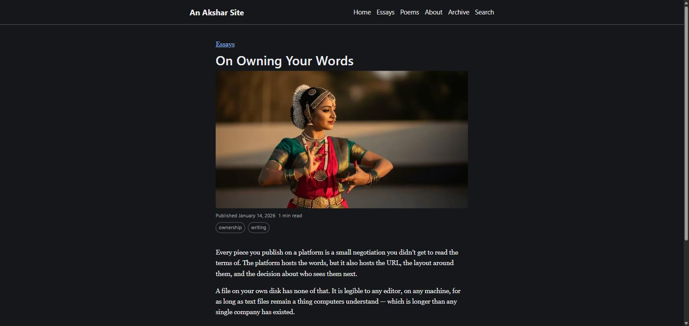

# Akshar — अक्षर

An open-source blog engine that turns a folder of Markdown files and one
configuration file into a fast, accessible, self-owned static website —
with a browser-based editor so a non-technical writer never has to see a
terminal.



## Who this is for

An indie writer — poetry, essays, criticism, a newsletter-style column —
who wants their work online under their own name: no platform tenancy, no
server to babysit, no monthly bill, and a complete, portable copy of
everything they've written. Also for a developer or an agency who sets a
site up _for_ that writer and then steps back — the whole point is that
they never need to come back.

It is **not**: a website builder, a newsletter platform, a paywall, a
comment system, a plugin platform, multi-author (yet), or a general-
purpose static site generator that happens to support blogs. See
[`mission.md`](./mission.md)'s Non-goals section for the full, deliberate
list — each one is a real feature declined on purpose, not an oversight.

## What you get

- A **template repository** you copy, fill in one config file, and push.
- A **browser editor** at `/admin` (or a hosted one, zero setup) — a
  writer publishes without touching Git.
- Posts, pages, sections, tags, search, an archive, RSS, a sitemap,
  correct share previews, and **zero third-party JavaScript** on a post
  page by default.
- **Six genuinely distinct presets** — one theme, six looks, all
  accessibility-checked, one of them tuned for Devanagari.
- **Free hosting**, host-agnostic by construction — GitHub Pages by
  default, any static host works.

## Quickstart

```sh
git clone https://github.com/LocalLandingCo/akshar.git my-site
cd my-site
npm install
npm run dev
```

Open `http://localhost:4321`. From here: edit `site.config.ts`, replace
the example posts under `content/`, and see
[`docs/setup.md`](./docs/setup.md) for the full 30-minute path to a
deployed site with a working editor.

Already writing? [`AUTHORING.md`](./AUTHORING.md) is the plain-language
guide for publishing day to day — no jargon, written for the writer, not
the developer.

## How it's built, and why

[`mission.md`](./mission.md) is _why_ this exists. [`spec.md`](./spec.md)
is _what_ it does. [`tech-stack.md`](./tech-stack.md) is _how_ — every
non-trivial choice recorded as an ADR, with the alternatives that were
rejected and why. Astro, static generation, Markdown + YAML in Git, no
database, no server, a hosted Git-based CMS for the browser editor.

## Status

**Pre-release, under active development.** The core engine, theming,
SEO, search, deployment, and authoring paths described above are built and
tested. Content import (WordPress/Blogger/Substack) is
[planned next](./spec.md#18-content-import).

## Contributing

[`CONTRIBUTING.md`](./CONTRIBUTING.md) — setup, checks to run before a PR,
and a pointer to the non-goals every contribution is checked against.

## License

MIT for the engine, themes, and documentation — see
[`LICENSE`](./LICENSE). A writer's own content is theirs and is never
covered by this license.
